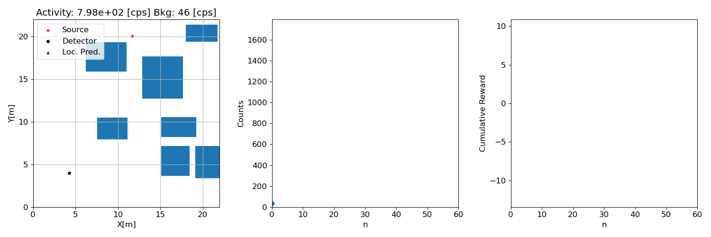

# Proximal Policy Optimization for Radiation Source Search
RAD-A2C architecture and proximal policy optimization (PPO) for radiation source search from our published [paper](https://www.mdpi.com/2673-4362/2/4/29). Base code from OpenAI's [Spinningup](https://github.com/openai/spinningup) repo. Below is a demo of a test episode where the trained deep reinforcement learning agent is controlling a radiation detector to search for a gamma radiation source in a non-convex environment (7 obstructions). 

The obstructions (gray rectangles) block line of sight between the detector and gamma source resulting in the detector only measuring background radiation. The left plot shows the detector path (black dots) in the environment, the agent's source location prediction (green triangle), and the gamma source (red star). The middle plot shows the measured gamma radiation intensity at each timestep and the right plot show the cumulative reward that the agent receives from its selected actions during an episode that is used during training to update the neural network weights. The episode terminates if the detector comes within 1.1 m of the gamma source (success) or if the episode length reaches 120 samples (failure).
## Installation
It is recommended to use the Anaconda package manager. 
1. After cloning this repository, create a virtual environment with the required packages 
`conda env create -f environment.yml`. 
Then activate this environment with `conda activate ppo_rad`.
The radiation\_ppo code requires [OpenMPI](https://www.open-mpi.org/software/ompi/v4.1/) for parallel processing.

2. Install the OpenAI gym environment `gym_rad_search`. 
Change into ``/gym_rad_search`` and use `pip install -e .`.

## Files
- ``/algo``: contains the PPO implementation and neural network architecture 
- ``/eval``: contains the scripts for evaluation and rendering of the trained models as well as the test environment generation and the test environments used in our paper. Gradient search and hybrid RID-FIM controller also included.
- ``/gym_rad_search``: contains the radiation source search OpenAI gym environment
- ``/models``: user trained and pretrained models
- ``/rl_tools``: various tools for logging and MPI setup
## Usage
1. Train model with ``ppo.py``, see argument help and ppo function for parameter documentation
    - Model will be saved to directory ``/args.env_name``
    - Plot training results using the ``rl_plots.py`` in ``eval/``. Ex: ``python rl_plots --data_dir ../models/pre_train/gru_8_acts/bpf/model_name``
    - Full training takes at least ~30 hours w/ 10 cores, a printout of metrics will display per epoch if everything is running correctly.
2. Test the model using ``test_policy.py``, any model changes made to ``/ppo/core.py`` must also be made in ``/eval/core.py``
    - Trained model parameters must be specified by user in the ``ac_kwargs`` dictionary, line 531 in ``test_policy.py``
    - See argument help for more details
